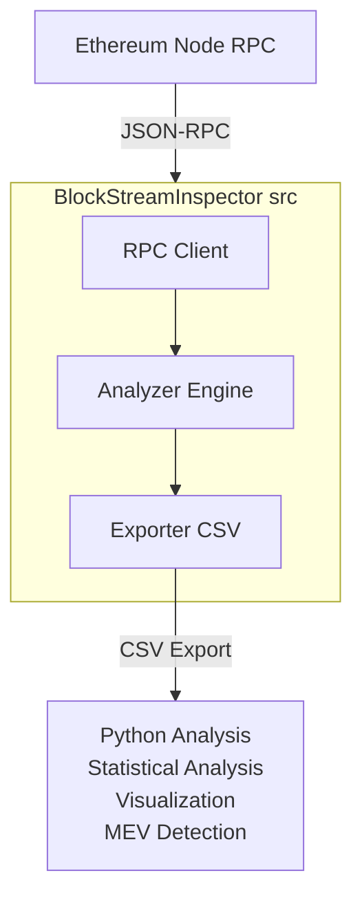

# Ethereum BlockStream Inspector

A comprehensive tool for analyzing Ethereum block production, timing, gas dynamics, and MEV activity. Built in Rust for performance with Python data analysis.

## Overview

BlockStream Inspector provides deep insights into Ethereum's block lifecycle by:
- **Fetching blocks** via RPC from live Ethereum nodes
- **Parsing block structure** including execution payloads, transactions, and metadata
- **Analyzing timing** patterns and block production dynamics
- **Detecting MEV** activity including sandwich attacks and arbitrage
- **Tracking PBS** (Proposer-Builder Separation) adoption
- **Exporting data** for comprehensive Python-based analysis

## Architecture



## Quick Start

### Prerequisites

```bash
# Rust toolchain
curl --proto '=https' --tlsv1.2 -sSf https://sh.rustup.rs | sh

# Python 3.8+
python3 --version

# Install Python dependencies
pip install pandas matplotlib seaborn numpy
```

### Building

```bash
# Clone and build
git clone https://github.com/dicethedev/blockstream-inspector.git
cd blockstream-inspector
cargo build --release

# The binary will be at target/release/blockstream-inspector
```

### Running

```bash
# Option 1 — Use environment variable (recommended)
export ALCHEMY_RPC_URL="https://eth-mainnet.g.alchemy.com/v2/YOUR_KEY"

# Analyze a single block
./target/release/blockstream-inspector block --number latest --verbose

# Analyze a range of blocks and export to CSV
./target/release/blockstream-inspector range \
    --start 18000000 --end 18000100 --output blocks.csv

# Live monitoring
./target/release/blockstream-inspector live --count 20 --output live.csv

# MEV detection
./target/release/blockstream-inspector mev --blocks 100 --threshold 0.1


# Option 2 — Pass RPC manually (overrides env)
./target/release/blockstream-inspector --rpc http://localhost:8545 block --number latest
```

### Analyzing Data

Before running any analysis, set up your Python environment:

1. Create and activate a virtual environment

```bash
python3 -m venv venv
source venv/bin/activate
```
2. Install required Python dependencies

```bash
pip install -r requirements.txt
```

If you don’t have a `requirements.txt`, install manually:

```bash
pip install pandas numpy matplotlib seaborn
```

Running Analysis Scripts

```bash
# Run comprehensive analysis
python3 scripts/analyze.py blocks.csv --all


# Specific analyses
python3 scripts/analyze.py blocks.csv --gas      # Gas metrics only
python3 scripts/analyze.py blocks.csv --mev      # MEV analysis only
python3 scripts/analyze.py blocks.csv --timing   # Block timing only
```

## Features & Metrics

### Block Lifecycle Tracking
- **Timestamp analysis**: Block production time, propagation delay estimation
- **Proposer identification**: Validator that proposed the block
- **Builder detection**: PBS builder identification from extra_data

### Gas Dynamics
- **Utilization tracking**: Gas used vs. gas limit
- **Base fee analysis**: EIP-1559 base fee per gas dynamics
- **Priority fees**: MEV bot and user priority fee patterns
- **Fee burning**: Total ETH burned via EIP-1559

### Transaction Analysis
- **Type classification**: Legacy, EIP-2930, EIP-1559, EIP-4844 blob transactions
- **Ordering analysis**: Detection of transaction ordering anomalies
- **Failed transactions**: Tracking of reverted transactions

### MEV Detection
- **Sandwich attacks**: Detection of frontrun-victim-backrun patterns
- **Arbitrage operations**: DEX arbitrage opportunity identification
- **Liquidations**: DeFi liquidation event tracking
- **Known MEV bots**: Recognition of known MEV bot addresses
- **Value estimation**: Quantification of extracted MEV in ETH

### PBS Metrics
- **PBS adoption**: Percentage of blocks built via PBS
- **Builder identification**: Detection of Flashbots, builder0x69, etc.
- **Builder payments**: Estimation of payments to proposers

## Technical Deep Dive

### Understanding Block Lifecycle

```mermaid
graph TD
    %% Define Node Styles
    classDef step fill:#f9f,stroke:#333,stroke-width:2px,color:#000;
    classDef subprocess fill:#add8e6,stroke:#333,stroke-width:1px,color:#000;
    classDef keypoint fill:#e0b0ff,stroke:#333,stroke-width:2px,color:#000,font-weight:bold;

    %% 1. Proposer Selection
    subgraph S1["1. Proposer Selection"]
        P1[Validator chosen by beacon chain]
        class P1 step;
    end

    %% 2. Block Building PBS
    subgraph S2["2. Block Building PBS"]
        B1[Builder constructs execution payload]
        B2[Includes high-value MEV transactions]
        B3[Submits sealed bid to proposer]
        
        B1 --> B2 --> B3
        class B1,B2,B3 subprocess;
    end

    %% 3. Block Proposal
    subgraph S3["3. Block Proposal"]
        P2[Proposer signs beacon block]
        P3[Includes execution payload hash]
        
        P2 --> P3
        class P2,P3 subprocess;
    end

    %% 4. Block Validation
    subgraph S4["4. Block Validation"]
        V1[Execution layer validates payload]
        V2[Consensus layer validates attestations]
        V3[Block added to canonical chain]
        
        V1 --> V3
        V2 --> V3
        class V1,V2,V3 subprocess;
    end
```



### Data Structures

The tool analyzes key Ethereum data structures:

- **Block Header**: `hash`, `parent_hash`, `state_root`, `transactions_root`, `receipts_root`
- **Execution Payload**: `transactions`, `gas_used`, `gas_limit`, `base_fee_per_gas`, `extra_data`
- **Transaction Types**: 
  - Type 0: Legacy
  - Type 1: EIP-2930 (Access Lists)
  - Type 2: EIP-1559 (Dynamic Fees)
  - Type 3: EIP-4844 (Blob Transactions)

### RPC Methods Used

```rust
eth_getBlockByNumber          // Fetch block with transactions
eth_getTransactionReceipt     // Get transaction execution details
eth_blockNumber               // Get latest block number
```

## Sample Output

```
═══════════════════════════════════════════════════
Block Number: 18500000
Block Hash: 0x1234...abcd
Timestamp: 1698765432
═══════════════════════════════════════════════════

⏱️  TIMING METRICS
  Block Time: 12.05s

⛽ GAS METRICS
  Gas Used: 29834521 / 30000000 (99.4%)
  Base Fee: 25.34 gwei
  Avg Priority Fee: 1.52 gwei
  Fees Burned: 0.7563 ETH
  Priority Fees: 0.0453 ETH

📝 TRANSACTIONS
  Total: 247
  Failed: 3
  Types: Legacy(12), EIP-2930(5), EIP-1559(225), EIP-4844(5)

💰 MEV INDICATORS
  Sandwich Attacks: 3
  Arbitrage Ops: 7
  Liquidations: 2
  Estimated MEV: 2.3451 ETH

🏗️  PBS METRICS
  PBS Block: Yes
  Builder: flashbots
```

## Learning Resources

### Ethereum Protocol Concepts

- **EIP-1559**: [Ethereum Fee Market](https://eips.ethereum.org/EIPS/eip-1559)
- **EIP-4844**: [Blob Transactions](https://eips.ethereum.org/EIPS/eip-4844)
- **PBS**: [Proposer-Builder Separation](https://ethresear.ch/t/proposer-block-builder-separation-friendly-fee-market-designs/9725)
- **MEV**: [Flashbots Research](https://docs.flashbots.net/)

### Related Projects

- [Reth](https://github.com/paradigmxyz/reth): Modular Ethereum execution client (Rust)
- [Lighthouse](https://github.com/sigp/lighthouse): Ethereum consensus client (Rust)
- [MEV-Inspect](https://github.com/flashbots/mev-inspect-py): MEV transaction analysis
- [Alloy](https://github.com/alloy-rs/alloy): High-performance Ethereum library (Rust)

## Development

### Project Structure

```
blockstream-inspector/
├── src/
│   ├── main.rs          # CLI entry point
│   ├── types.rs         # Data structures
│   ├── rpc.rs           # Ethereum RPC client
│   ├── analyzer.rs      # Core analysis logic
│   └── exporter.rs      # CSV export
├── scripts/
│   └── analyze.py       # Python data analysis
├── data/                # Sample data (gitignored)
├── docs/                # Additional documentation
└── Cargo.toml           # Rust dependencies
```

### Testing

```bash
# Run Rust unit + integration tests
cargo test

# --- Local Development Testing ---

# 1. Start a local Ethereum node (Geth example)
docker run -d -p 8545:8545 ethereum/client-go \
    --http --http.addr "0.0.0.0" --http.api "eth,net,web3"

# 2. Set RPC URL using environment variable (recommended)
export ALCHEMY_RPC_URL="https://eth-mainnet.g.alchemy.com/v2/YOUR_KEY"

# Then analyze blocks (no need to pass --rpc explicitly)
cargo run -- block --number latest

# 3. Override environment variable manually (optional)
cargo run -- --rpc http://localhost:8545 block --number latest

```

### Extending

To add new analysis features:

1. Add fields to `BlockLifecycle` in `types.rs`
2. Implement analysis logic in `analyzer.rs`
3. Update CSV export in `exporter.rs`
4. Add Python visualization in `scripts/analyze.py`

## Use Cases

### For Researchers
- Study gas market dynamics and EIP-1559 effectiveness
- Analyze PBS adoption rates and builder centralization
- Quantify MEV extraction across different periods
- Investigate transaction ordering and block building strategies

### For Developers
- Monitor dApp transaction inclusion patterns
- Analyze gas optimization opportunities
- Detect MEV vulnerabilities in protocols
- Study block production timing for time-sensitive applications

### For Validators
- Understand PBS builder payment patterns
- Analyze block proposal timing and success rates
- Monitor MEV relay performance
- Track validator rewards and fee distribution

## Future Enhancements

- [ ] Real-time mempool analysis
- [ ] Integration with MEV-Boost relay data
- [ ] Historical data aggregation and trending
- [ ] GraphQL API for data access
- [ ] Web dashboard for visualization
- [ ] Machine learning for MEV prediction
- [ ] Cross-chain analysis (L2s, sidechains)
- [ ] SSZ/Merkle proof verification

## License

MIT License - see LICENSE file for details
## Acknowledgments

Special thanks to:
- Alloy and Ethers-rs teams for excellent Rust libraries
- MEV research community for insights and documentation

---

*"Understanding how blocks are built is fundamental to improving Ethereum's protocol."*