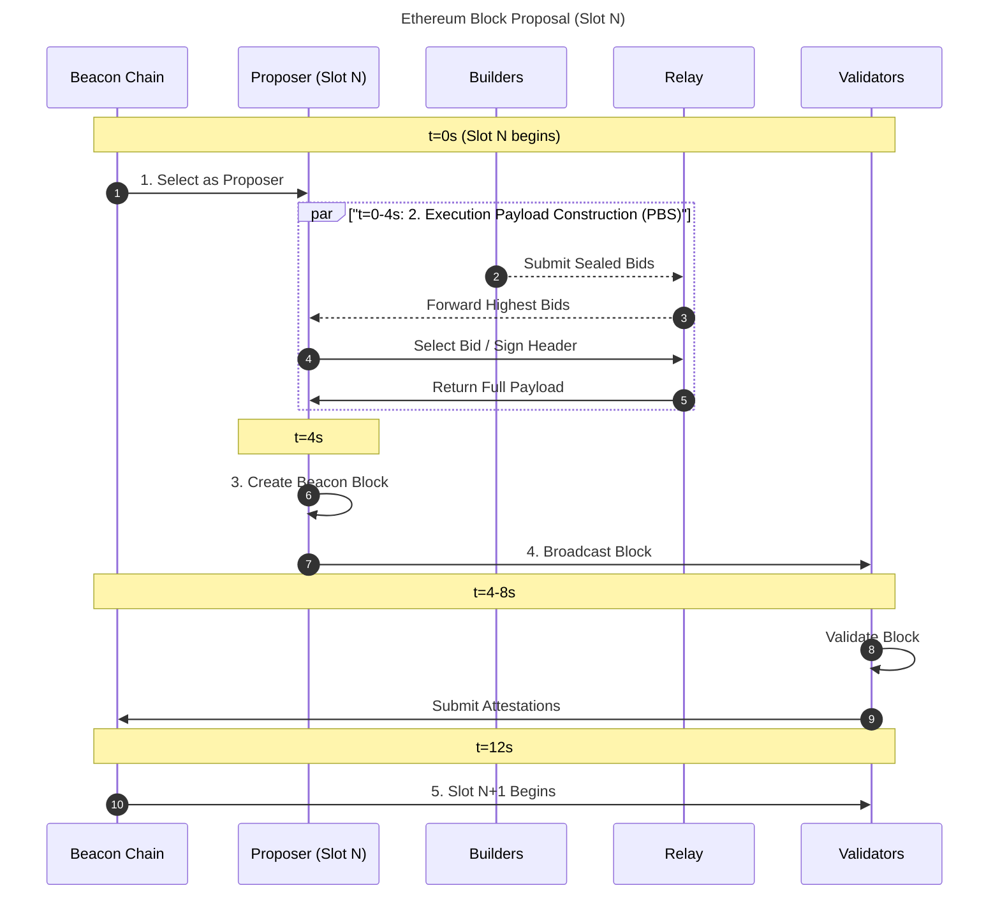

# Technical Deep Dive: Ethereum Block Lifecycle & PBS

## Introduction

This document provides technical context for the BlockStream Inspector for Ethereum and demonstrates understanding of Ethereum's core protocol mechanisms, particularly around block production, PBS (Proposer-Builder Separation), and MEV (Maximal Extractable Value).

## Block Production in Post-Merge Ethereum

### Consensus & Execution Layer Interaction

Since The Merge (September 2022), Ethereum operates with two distinct layers:

1. **Consensus Layer (CL)** - Previously "Eth2" beacon chain
   - Runs Proof-of-Stake consensus
   - Manages validator set and block proposals
   - Produces beacon blocks containing execution payload headers

2. **Execution Layer (EL)** - Previously "Eth1" mainnet
   - Processes transactions and smart contract execution
   - Maintains state (accounts, storage)
   - Produces execution payloads (what we traditionally think of as "blocks")

These layers communicate via the **Engine API**, a JSON-RPC interface with key methods:
- `engine_newPayloadV3`: CL sends execution payload to EL for validation
- `engine_forkchoiceUpdatedV3`: CL informs EL of the canonical chain head
- `engine_getPayloadV3`: CL requests execution payload from EL for proposal

### Block Production Flow



## Proposer-Builder Separation (PBS)

### Motivation

PBS emerged to address several issues with validator-built blocks:

1. **MEV Centralization**: Validators with better MEV extraction become more profitable
2. **Specialized Infrastructure**: Optimal block building requires significant technical resources
3. **Network Security**: Concentration of MEV profits threatens validator decentralization

### Current PBS Architecture (Out-of-Protocol)

The current implementation uses **MEV-Boost**, a sidecar service:

```mermaid
graph TD
    A[Validator<br/>(Proposer)]
    B(MEV-Boost<br/>Middleware<br/>(Sidecar software))
    
    subgraph Relays
        R1[Relay 1]
        R2[Relay]
        R3[Relay 3]
        R_etc[...]
    end
    
    subgraph Builders
        B1[Builder 1]
        BN[Builder N]
    end
    
    A -- "Request best bid" --> B
    
    B -- "Query multiple relays" --> R1
    B --> R2
    B --> R3
    B --> R_etc
    
    R1 --> B1
    R3 --> BN
```

### Key Components

**Builders**:
- Construct execution payloads optimized for MEV extraction
- Compete on payment to proposer
- Examples: Flashbots, builder0x69, rsync-builder, BeaverBuild

**Relays**:
- Trusted intermediaries between builders and proposers
- Verify block validity before forwarding
- Escrow builder payments
- Provide DoS protection

**Proposers**:
- Select highest-paying valid bid
- Sign beacon block
- Reveal execution payload after signing

### PBS Trust Assumptions

Current PBS implementation requires:
1. **Trust in relays**: Must verify blocks correctly and not steal MEV
2. **Censorship resistance**: Relays can censor transactions
3. **Builder dominance**: Small number of builders creates centralization risk

### Identifying PBS Blocks in BlockStream Inspector

BlockStream Inspector detects PBS blocks through several signals:

1. **Extra Data Field**: Builders often include identifiers
   ```rust
   let extra_data = block.extra_data;
   // Example: "flashbots" or "builder0x69"
   ```

2. **Coinbase Transactions**: Builder payment appears as first transaction
   ```rust
   if let Some(first_tx) = block.transactions.first() {
       if first_tx.to == Some(block.miner) && first_tx.value > 0 {
           // Likely builder payment
       }
   }
   ```

3. **Transaction Ordering**: PBS blocks often show MEV-optimized ordering

## EIP-1559 Gas Dynamics

### Fee Structure

Post-EIP-1559, transaction fees have two components:

```
Total Fee = (Base Fee + Priority Fee) × Gas Used
```

**Base Fee**:
- Algorithmically determined based on previous block's gas usage
- Burned (permanently removed from circulation)
- Adjusts block-by-block to target 50% gas utilization

**Priority Fee** (Tip):
- Set by user to incentivize inclusion
- Goes to block proposer (or builder in PBS)
- Allows users to "pay for priority"

### Base Fee Adjustment Algorithm

```python
def calculate_base_fee(parent_gas_used, parent_gas_target, parent_base_fee):
    """
    EIP-1559 base fee calculation
    """
    if parent_gas_used == parent_gas_target:
        return parent_base_fee
    
    elif parent_gas_used > parent_gas_target:
        # Increase base fee (block was full)
        gas_used_delta = parent_gas_used - parent_gas_target
        base_fee_delta = max(
            parent_base_fee * gas_used_delta // parent_gas_target // 8,
            1
        )
        return parent_base_fee + base_fee_delta
    
    else:
        # Decrease base fee (block had space)
        gas_used_delta = parent_gas_target - parent_gas_used
        base_fee_delta = parent_base_fee * gas_used_delta // parent_gas_target // 8
        return max(parent_base_fee - base_fee_delta, 0)
```

Maximum change per block: ±12.5%

### BlockStream Inspector Gas Analysis

BlockStream Inspector tracks:
1. **Gas utilization**: Actual usage vs. limit
2. **Base fee trends**: Response to demand
3. **Priority fee distribution**: User willingness to pay
4. **Burned fees**: Economic impact of EIP-1559

## MEV Detection Methodologies

### Sandwich Attacks

**Pattern**:
```
Block:
├─ Tx 1: Attacker buys token X (frontrun)
├─ Tx 2: Victim swaps ETH → token X (victim)
└─ Tx 3: Attacker sells token X (backrun)
```

**Detection Heuristics**:
```rust
fn detect_sandwich(transactions: &[Transaction]) -> Vec<SandwichAttack> {
    // 1. Find transactions interacting with same DEX pool
    // 2. Check if address appears before and after other tx
    // 3. Verify same token pair
    // 4. Calculate profit from price impact
}
```

### DEX Arbitrage

**Pattern**:
Single transaction that:
- Interacts with multiple DEXes
- Ends with same token it started with
- Net profit after gas

**Detection**:
```rust
fn detect_arbitrage(tx: &Transaction, receipt: &TransactionReceipt) -> Option<ArbitrageOp> {
    // 1. Parse transaction logs for DEX interactions
    // 2. Track token flow through transaction
    // 3. Calculate if starting and ending token match
    // 4. Compute profit
}
```

### Known MEV Bot Identification

BlockStream Inspector maintains a list of known MEV bot addresses:
- `0x0000000000007f150bd6f54c40a34d7c3d5e9f56`
- `0xa57bd00134b2850b2a1c55860c9e9ea100fdd6cf`
- Many more (I will adding more soon)...

These are identified through:
1. Public disclosures
2. Pattern analysis
3. Community research (e.g., EigenPhi, Flashbots)

## Transaction Types

### Type 0: Legacy Transactions
```
{
    "from": "0x...",
    "to": "0x...",
    "value": "1000000000000000000",
    "gasPrice": "20000000000",
    "nonce": 5
}
```
- Pre-EIP-1559 format
- Single `gasPrice` field
- Still valid post-EIP-1559

### Type 1: EIP-2930 (Access Lists)
```
{
    "type": "0x1",
    "accessList": [
        {
            "address": "0x...",
            "storageKeys": ["0x..."]
        }
    ],
    ...
}
```
- Declares storage access upfront
- Can reduce gas costs
- Rarely used in practice

### Type 2: EIP-1559
```
{
    "type": "0x2",
    "maxFeePerGas": "30000000000",
    "maxPriorityFeePerGas": "2000000000",
    ...
}
```
- Standard post-London hardfork
- Separates base and priority fees
- Most common transaction type

### Type 3: EIP-4844 (Blob Transactions)
```
{
    "type": "0x3",
    "maxFeePerBlobGas": "1000000",
    "blobVersionedHashes": ["0x..."],
    ...
}
```
- Introduced in Dencun upgrade (March 2024)
- Carries blob data for L2s
- Separate blob gas market
- Critical for L2 scaling

## Data Structures

### Block Structure (Simplified)
```rust
pub struct Block {
    pub number: u64,
    pub hash: H256,
    pub parent_hash: H256,
    pub timestamp: u64,
    pub miner: Address,           // Coinbase address
    pub gas_used: u64,
    pub gas_limit: u64,
    pub base_fee_per_gas: Option<U256>,
    pub transactions: Vec<Transaction>,
    pub extra_data: Bytes,
    // Many more fields...
}
```

### Transaction Structure
```rust
pub struct Transaction {
    pub hash: H256,
    pub from: Address,
    pub to: Option<Address>,
    pub value: U256,
    pub gas: u64,
    pub gas_price: Option<U256>,
    pub max_fee_per_gas: Option<U256>,
    pub max_priority_fee_per_gas: Option<U256>,
    pub transaction_type: Option<U256>,
    // ...
}
```

## Future Protocol Developments

### Enshrined PBS (ePBS)

Long-term goal: Move PBS into protocol itself

Benefits:
- No trust in relays needed
- Cryptographic guarantees instead of economic trust
- Potential for better censorship resistance

Challenges:
- Complex protocol changes
- Consensus on implementation
- Migration from current system

### MEV Burn

Proposal to burn MEV payments instead of giving to proposers:
- Reduces validator centralization pressure
- Captures MEV value for all ETH holders
- Controversial: reduces validator income

### Inclusion Lists

Mechanism to enforce censorship resistance:
- Proposer submits mandatory transaction list
- Builder must include these transactions
- Prevents builder censorship

## Performance Considerations in BlockStream Inspector

### RPC Efficiency
```rust
// Batch requests to reduce round trips
let futures: Vec<_> = (start..=end)
    .map(|n| client.get_block_with_txs(n))
    .collect();
    
let blocks = futures::future::join_all(futures).await;
```

### Async Processing
- I use Tokio runtime for concurrent RPC calls
- Non-blocking I/O for network requests
- Parallel analysis where possible

### Memory Management
- Stream processing for large block ranges
- CSV export to avoid holding all data in memory
- Rust's ownership system prevents memory leaks

## Conclusion

BlockStream Inspector provides a practical tool for understanding Ethereum's block lifecycle while demonstrating comprehension of:

1. **Protocol Mechanics**: CL/EL interaction, Engine API, block production
2. **Economic Incentives**: PBS, MEV, fee markets
3. **Transaction Types**: Legacy through EIP-4844 blobs
4. **Data Structures**: Blocks, transactions, receipts
5. **Network Dynamics**: Propagation, timing, validation

This knowledge is essential for protocol-level work, particularly in prototyping new features and understanding their real-world implications.

## References

1. [EIP-1559: Fee Market Change](https://eips.ethereum.org/EIPS/eip-1559)
2. [EIP-4844: Shard Blob Transactions](https://eips.ethereum.org/EIPS/eip-4844)
3. [Engine API Specification](https://github.com/ethereum/execution-apis/blob/main/src/engine/common.md)
4. [MEV-Boost Documentation](https://boost.flashbots.net/)
5. [Proposer-Builder Separation](https://ethresear.ch/t/proposer-block-builder-separation-friendly-fee-market-designs/9725)
6. [PBS Censorship Resistance](https://ethresear.ch/t/how-much-can-we-constrain-builders-without-bringing-back-heavy-burdens-to-proposers/13808)

---

**Author**: Blessing  
**Date**: November 2025